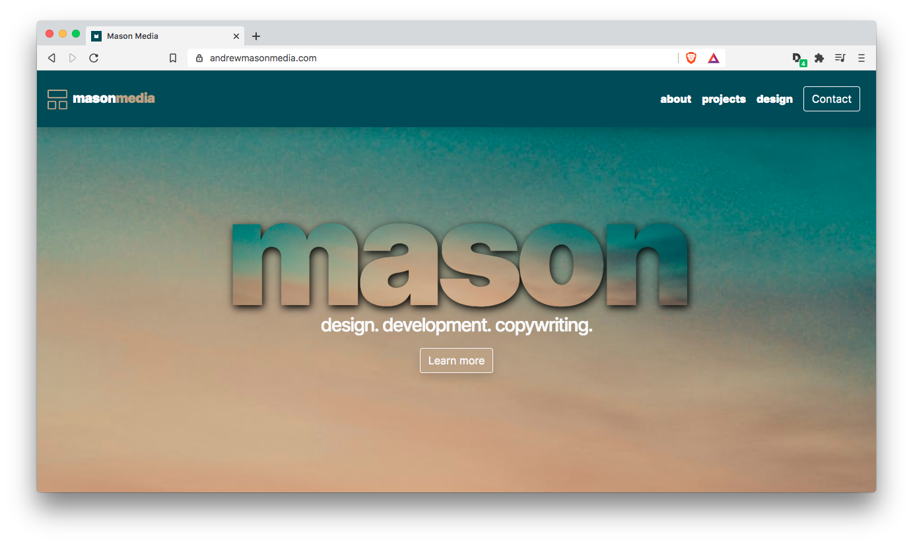

# Mason Media Home Site

## Intro

Repo for Mason Media, the web development studio of Andrew Mason. I'm a Toronto frontend developer, graphic designer, and copywriter. This site was built from scratch using React, Gatsby, HTML5, SASS/CSS3, React-Bootstrap, Javascript, and React-Reveal. I use the Github GraphQL API to pull repo data as well as the Cloudinary API to source images and image data for my design page.

### License

Copyright 2020 Andrew Mason. 
